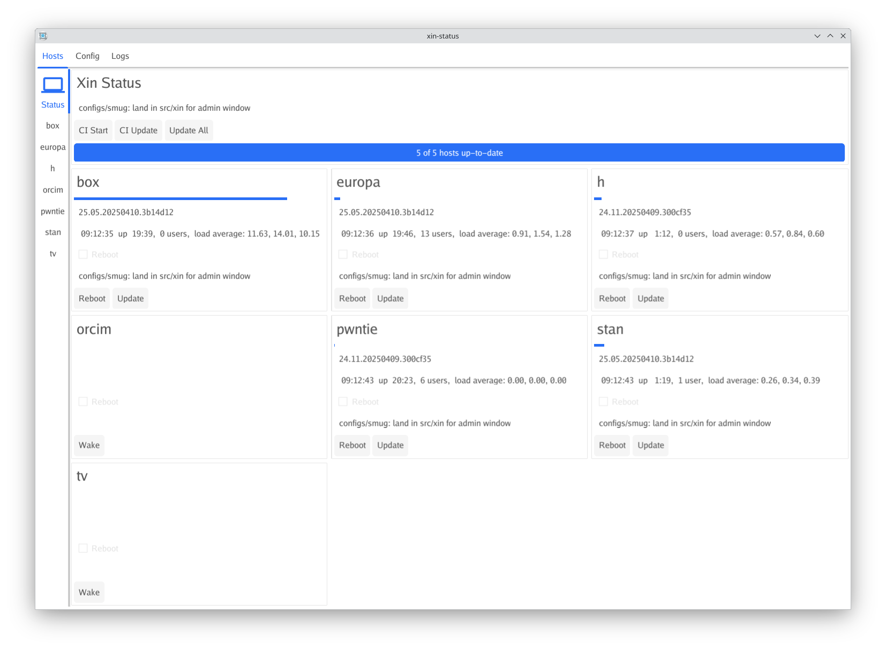
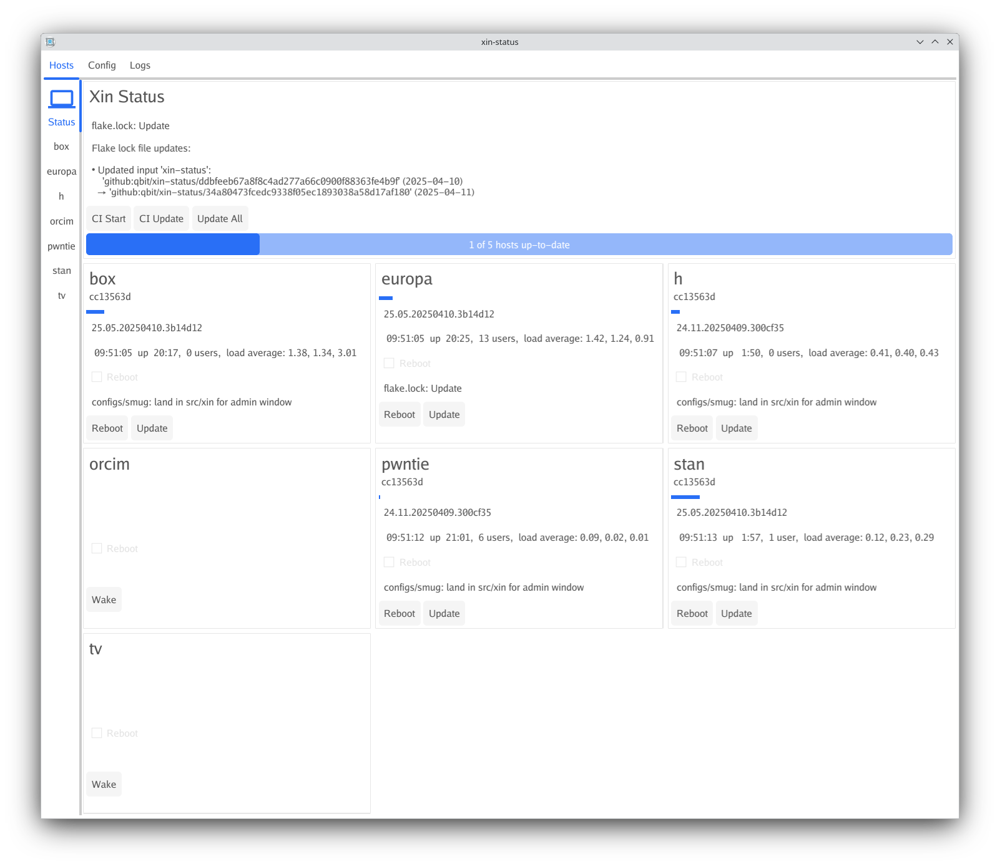
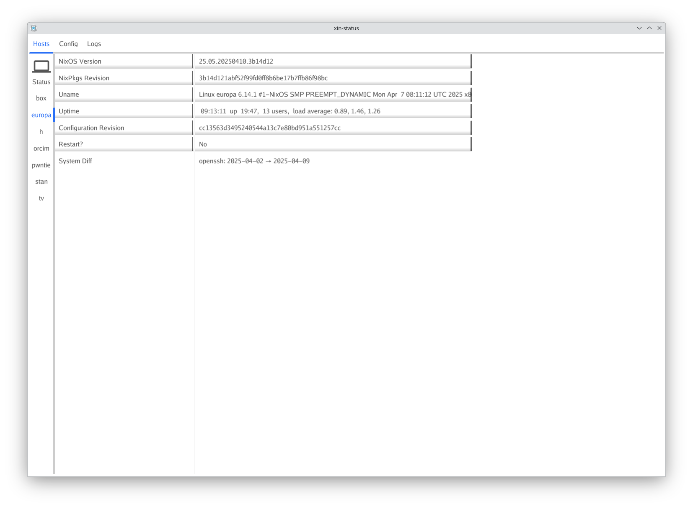

xin-status
==========

A simple management tool for NixOS machines.

# Features
- Up-to-date status for all configured machines
- Status overview: uptime, version string, load / cpu usage, reboot status, reboot and update buttons
- Host view: system diff, nixpkgs / configuration revisions
- Wake remote hosts using WOL

# Using

## flake
``` nix
  inputs = {
...
    xin-status = {
      url = "github:qbit/xin-status";
    };
...
  };
  outputs = { ... xin-status ... }: {
...
  nixosConfigurations.your-machine-name = nixpkgs.lib.nixosSystem {
    system = "x86_64-linux"
    modules = [
      xin-status.nixosModules.default
    ];
    nixpkgs.overlays = [
      xin-status.overlays.default
    ];
  };

```

## config

``` nix
{
  config = {

    # On any machines you want xin-status to be able to show info for:
    programs.xin = {
      enable = true;
      monitorKeys = [
        "ssh-ed25519 AA.....ENU"
      ];
    };

    # On a machine you will run xin-status from
    programs.xin-status = {
      enable = true;
      settings = {
        repository = "/path/to/git/clone/";
	privKeyPath = "/path/to/private/key";
	flakeRss = "https://github.../main.atom";
	statuses = [
	  {
	    host = "somemachine";
	  }
	];
      };
    };
  };
}
```

# Screenshots



